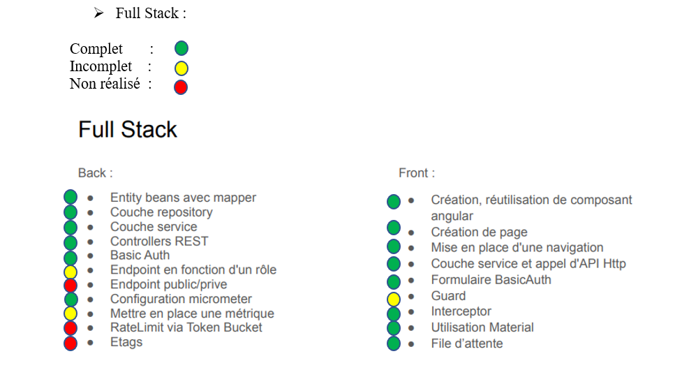
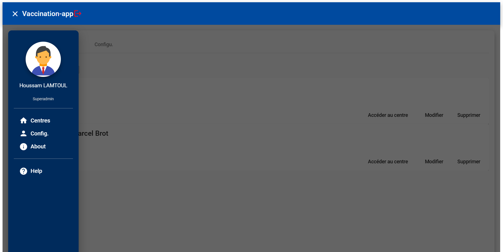
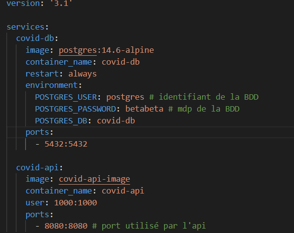

N.B : - L'application est dans le dossier 'VF'
   
   Pour tester la connexion voici un exemple pour le Superadmin : 
   
   Superadmin :
   
      login : superadmin
      
      mot de passe : password
      
  Les fonctionnalitées d'ajout/supression/modification d'un centre par exemple fonctionnent très bien.Voici un résumé de ce que nous avons pu réaliser :
      

Ce projet est réalisé par :

|Nom|Prénom|N° étudiant|
| :-: | :-: | :-: |
|Houssam |LAMTOUL|31828603|
|Marwane|KADDAM|31733026|
|Achraf|HDADI|31733025|

Houssam LAMTOUL(31828603)

Marwane KADDAM(31733026) 

Achraf HDADI(31733025)

Ce projet consiste a programmer une application permettant de prendre un rendez-vous pour une vaccination COVID dans un centre de vaccination en France et ceci en utilisant pgadmin comme base de donnée

Base de donnée:

Nous avons utilisé pgAdmin comme base de données avec le backend Spring car il offre une variété de fonctionnalités pour gérer et administrer facilement une base de données PostgreSQL. Il permet une visualisation graphique des tables, des vues, des index et des relations, facilitant ainsi la création et la modification des données. Il permet également d'exécuter des requêtes SQL et de visualiser les résultats de manière claire et détaillée. En utilisant pgAdmin avec Spring, nous avons pu facilement intégrer les fonctionnalités de gestion de base de données dans notre application, améliorant ainsi la gestion et la performance des données.

- Back-end : *Basicauth* 

Tout d'abord, nous avons choisi d'utiliser l'authentification basique car elle est simple, facile à mettre en œuvre et relativement sûre lorsqu'elle est combinée avec HTTPS. C'est un schéma d'authentification très populaire et il est compatible avec la plupart des systèmes d'exploitation et des navigateurs. En outre, il est très fiable et peut être utilisé pour sécuriser des informations sensibles. Il permet également aux utilisateurs de se connecter en toute sécurité et de restreindre l'accès à certaines ressources.

Les avantages de l'utilisation de JWT pour l'authentification sont:

- **La facilité de déploiement** car il n'y a pas besoin de stocker les informations d'authentification dans la session de l'utilisateur sur le serveur
- **La possibilité de valider les jetons** sur plusieurs serveurs ou domaines
- **La possibilité de stocker des informations supplémentaires** dans le jeton pour une utilisation ultérieure, comme les rôles de l'utilisateur.

.

- Front-end : *vaccination-app*

Grâce aux composants de Angular material (tels que boutons, Modèles de navigation, tableaux de données, modales, fenêtres contextuelles et les composants de mise en page : cartes, listes) nous avons pu réaliser un Front cohérent en code et facile à utiliser et à tester.

De plus, le responsive est géré automatiquement ce qui permet l’utilisation de l’application sur n’importe quelle interface.

Le Front est composé de plusieurs components :

1) Admin
1) Ajcentre
1) Ajpersonne
1) Connexion
1) Filedattente
1) Home
1) Inscription
1) Medecin
1) Modifier-centre
1) Modifier-personne
1) Reservation
1) Superadmin
1) Vaccination-center
1) Validation-reservation

La liaison entre les pages est géré grâce au routing (voir app-routing.module.ts) qui permet de gérer les redirections d'URL et de charger les composants appropriés en fonction de l'URL demandée. Il utilise des routes configurées dans un fichier de configuration de routage pour associer des URL spécifiques à des composants de l'application. 

Lorsqu'un utilisateur (médecin-admin-superadmin-utilisateur publique) navigue dans l'application ou saisit une URL dans la barre d'adresse, le routeur Angular utilise les routes configurées pour déterminer quel composant doit être chargé et affiché à l'utilisateur.

- Barre de recherche : 

Lorsque l'utilisateur saisit un terme de recherche dans la barre de recherche, cela déclenche un événement qui envoie les données de recherche à un service de l'application. Ce service peut ensuite utiliser ces données pour effectuer une requête à une base de données pour récupérer les résultats de recherche correspondants. Les résultats de la recherche sont affichés dans un composant distinct, une liste de résultats de recherche dans notre cas.

- Les Guards :

Les guards en Angular sont des services qui permettent de protéger les routes de l'application en vérifiant les conditions de navigation avant de charger un composant associé à cette route. Il existe plusieurs types de guards, tels que ***CanActivate***, ***CanDeactivate***, ***CanLoad***, et ***Resolve***.

***CanActivate*** : permet de vérifier si un utilisateur est autorisé à accéder à une route donnée avant que le composant associé ne soit chargé. Il peut être utilisé pour vérifier si un utilisateur est authentifié ou possède les autorisations nécessaires pour accéder à une route spécifique.

***CanDeactivate*** : permet de vérifier si un utilisateur est autorisé à quitter une route donnée avant de charger un autre composant. Il peut être utilisé pour vérifier si un utilisateur a enregistré des modifications non enregistrées dans un formulaire avant de quitter la page.

***CanLoad*** : permet de vérifier si un utilisateur est autorisé à charger les modules d'une route donnée avant de les charger. Il peut être utilisé pour vérifier si un utilisateur est authentifié ou possède les autorisations nécessaires pour accéder à un module spécifique.

***Resolve*** : permet de charger les données nécessaires à une route avant de charger le composant associé. Il peut être utilisé pour charger les données d'un composant à partir d'une API avant que le composant ne soit affiché à l'utilisateur.

Les guards peuvent être utilisés pour protéger les routes de l'application et pour gérer les redirections en cas d'échec de la vérification des conditions de navigation.

intercepteurs:
Nous utilisons les intercepteurs d'Angular dans notre application pour ajouter des en-têtes personnalisés, pour logger les requêtes, pour modifier les réponses et pour gérer les erreurs. L'intercepteur d'Angular est très utile pour ajouter des en-têtes personnalisés à chaque requête. Nous pouvons également utiliser cet intercepteur pour conserver un journal des réponses des serveurs. Cela nous permet de détecter les erreurs et de les enregistrer dans le journal. De plus, nous pouvons également utiliser l'intercepteur pour modifier les réponses des serveurs avant de les transmettre à l'application. Enfin, l'intercepteur permet d'annuler les requêtes en cours et de changer l'URL de la requête.

Voici des exemples de quelques pages :

**section recherche d’un centre de vaccination :**

**interface reservation :**

**interface Superadmin :**

**interface connexion :**

**interface ajouter un centre de vaccination :**

**interface accueil :**

- Mise en production : 

Nous utilisons le fichier JAR compilé de l'application et le plaçons dans une image qui comprend une JRE pour l'exécution en Java. (la commande : ***gradle build**)* et ensuite ***docker build -t covid-api-image*** pour builder l’image.

Pour lancer l'application, il est recommandé d'utiliser un fichier docker-compose qui démarrera également la base de données. Il est important de désactiver le service PostgreSQL en cours d'exécution sur l'ordinateur afin d'éviter des conflits de ports.

